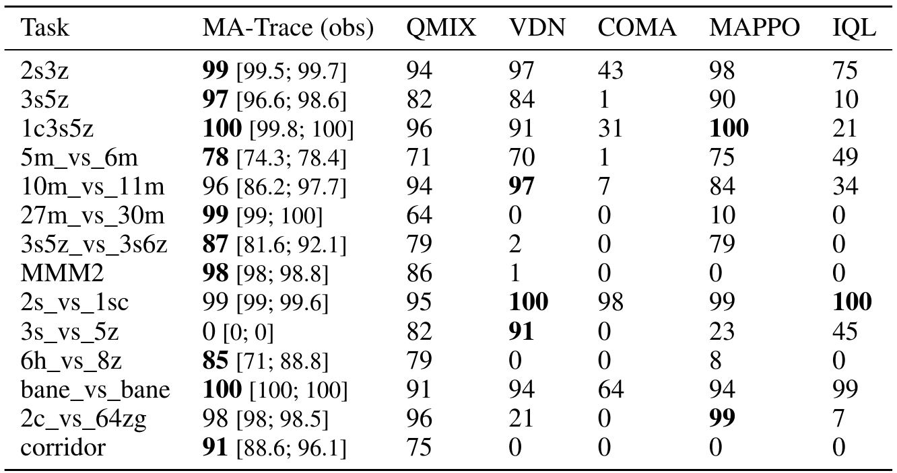

# Off-Policy Correction For Multi-Agent Reinforcement Learning

This repository is the official implementation of Off-Policy Correction For Multi-Agent Reinforcement Learning.
It is based on [SEED RL](https://github.com/google-research/seed_rl), commit 5f07ba2a072c7a562070b5a0b3574b86cd72980f.

## Requirements

Execution of our code is done within [Docker](https://www.docker.com/) container, you must install Docker according to the instructions provided by the authors.
The specific requirements for our project are prepared as dockerfile (docker/Dockerfile.starcraft) and installed inside a container during the first execution of running script.
Before running training, firstly build its base image by running:
```
./docker_base/marlgrid/docker/build_base.sh
```

Note that to execute docker commands you may need to use `sudo` or install Docker in rootless mode.

## Training

To train a MA-Trace model, run the following command:
```
./run_local.sh starcraft vtrace [nb of actors] [configuration]
```
The `[nb of actors]` specifies the number of workers used for training, should be a positive natural number.

The `[configuration]` specifies the hyperparameters of training.

The most important hyperparameters are:
- `learning_rate` the learning rate
- `entropy_cost` initial entropy cost
- `target_entropy` final entropy cost
- `entropy_cost_adjustment_speed` how fast should entropy cost be adjusted towards the final value
- `frames_stacked` the number of stacked frames
- `batch_size` the size of training batches
- `discounting` the discount factor
- `full_state_critic` whether to use full state as input to critic network, set False to use only agents' observations
- `is_centralized` whether to perform centralized or decentralized training
- `task_name` name of the SMAC task to train on, see the section below

There are other parameters to configure, listed in the files, though of minor importance.

The running script provides evaluation metrics during training.
They are displayed using [tmux](https://github.com/tmux/tmux/wiki), consider checking the navigation controls.

For example, to use default parameters and one actor, run:
```
./run_local.sh starcraft vtrace 1 ""
```

To train the algorithm specified in the paper:
- MA-Trace (obs): `./run_local.sh starcraft vtrace 1 "--full_state_critic=False"`
- MA-Trace (full): `./run_local.sh starcraft vtrace 1 "--full_state_critic=True"`
- DecMa-Trace: `./run_local.sh starcraft vtrace 1 "--is_centralized=False"`
- MA-Trace (obs) with 3 stacked observations: `./run_local.sh starcraft vtrace 1 "--full_state_critic=False --frames_stacked=3"`
- MA-Trace (full) with 4 stacked observations: `./run_local.sh starcraft vtrace 1 "--full_state_critic=True --frames_stacked=4"`

Note that to match the perforance presented in the paper it is required to use higher number of actors, e.g. 20.

## StarCraft Multi-Agent Challange

We evaluate our models on the [StarCraft Multi-Agent Challange](https://github.com/oxwhirl/smac) benchmark (latest version, i.e. 4.10).
The challange consists of 14 tasks: '2s_vs_1sc', '2s3z', '3s5z', '1c3s5z', '10m_vs_11m', '2c_vs_64zg', 'bane_vs_bane', '5m_vs_6m', '3s_vs_5z', '3s5z_vs_3s6z', '6h_vs_8z', '27m_vs_30m', 'MMM2' and 'corridor'.

To train on a chosen task, e.g. 'MMM2', add `--task_name='MMM2'` to configuration, e.g.
```
./run_local.sh starcraft vtrace 1 "--full_state_critic=False --task_name='MMM2'"
```

## Results

Our model achieves the following performance on SMAC:


